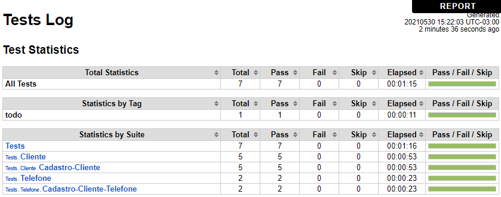

# Teste de software do projeto Clientes Gestor

Teste de Software usando o Robot Framework para automatizar os testes de aceitação (ATDD) no software Clientes Gestor.



## Recursos usados no desenvolvimento:

- Robot Framework
- BDD
- Python

## Instalação:

Para começar, você deve simplesmente clonar o repositório do projeto na sua máquina, instalar os pre-requisitos.

### Pre-requisitos:

Antes de instalar o projeto, você precisa já ter instalado na sua máquina:

- Projeto [Clientes Gestor](https://github.com/douglascarlos-dev/Clientes-Gestor)
- Python,
- Robot Framework
- psycopg2

### Obtendo uma cópia:

```shell
# Antes de tudo, clone o projeto
$ git clone https://github.com/douglascarlos-dev/Robot-Framework-Clientes-Gestor
```

### Execução:

```shell
# Execute o projeto
$ robot -d logs tests\cadastro-cliente.robot
$ robot -d logs tests\cadastro-cliente-telefone.robot
```